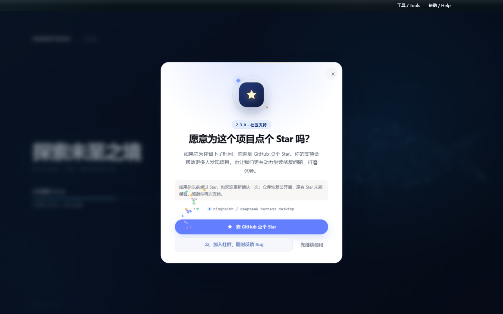
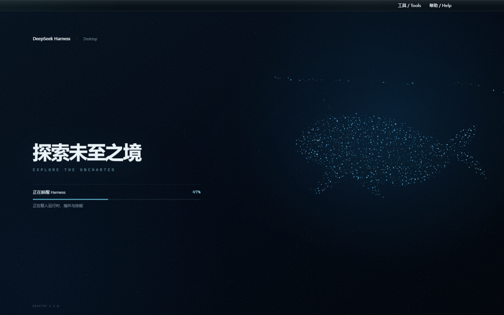
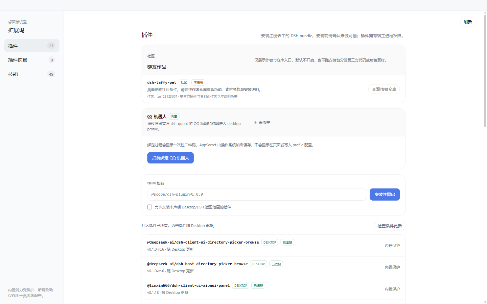

# DeepSeek Harness Desktop

[中文](README.md) | English

DeepSeek Harness Desktop is a community-maintained, open-source Windows AI coding client. One Windows x64 installer bundles the complete DeepSeek Harness Web Surface, the official local DSH host, plugins, Skills, themes, and automatic updates. It supports Windows 10/11, uses the BSD-3-Clause license, and requires no separate Node.js setup.

## Community QQ Group

Group number: **1105158177** · **[Join the QQ group](https://qm.qq.com/q/vehlNjaeye)**

## Windows Desktop

DeepSeek Harness Desktop brings the complete DSH Web surface to a Windows EXE. It does not rewrite the interface: a hardened Electron window launches the official `@deepseek-ai/dsh` host locally and loads every plugin and skin from this repository unchanged.

[Explore the product site](https://ningbainb.github.io/deepseek-harness-desktop/) · [Download the Windows x64 installer](https://github.com/ningbainb/deepseek-harness-desktop/releases/latest) · [Desktop technical guide](docs/desktop.md) · [Compatibility policy](docs/compatibility-policy.md) · [Runtime support policy](docs/runtime-support-policy.md) · [Upgrade and rollback](docs/upgrade-and-rollback.md) · [Maintainer release workflow](docs/launch/desktop-release-workflow.md) · [Changelog](CHANGELOG.md)

If this project helps you, Star the [GitHub repository](https://github.com/ningbainb/deepseek-harness-desktop) so more desktop users can discover it.

### Latest release: 3.0.7

`desktop-v3.0.7` uses direct loading and zero-click automatic repair: [read the full release notes](docs/launch/release-notes.md) · [read the compatibility and runtime policies](docs/compatibility-policy.md) · [read upgrade and rollback](docs/upgrade-and-rollback.md). Release assets include `SHA256SUMS.txt`, `release-manifest.json`, and channel metadata; the manifest records the actual signature state of each asset.

| Version | Highlights |
| --- | --- |
| **3.0.7** | Loads the existing Home and every plugin directly; retries the full profile unchanged, can use a configured model for bounded transactional repair, rolls back rejected candidates, and falls back to built-ins in the same Home without startup choices. |
| **3.0.1** | Freezes SDK/Contract/Provider/Schema boundaries; separates Stable and Beta; adds the controlled Runtime matrix and patch policy, privacy-redacted JSON/ZIP diagnostics, and release-manifest/signing infrastructure; telemetry is disabled by default. |
| **2.7.0** | Fixes the Windows 8% Runtime startup failure and moves to DSH rc.7; adds tray background automation, Host durable task scheduling, plugin compatibility declarations/lock state, the browser-safe Desktop SDK, safe workspace external opening, and Candidate Matrix. |
| **2.6.0** | Adds Task Board v3 Projects, Task Runs, derived Evidence, explicit Git Worktree review, capability-based shared-workspace fallback, and Candidate execution fixtures. Its historical anonymous-metrics behavior is replaced by the 3.0 default-off policy. |
| **2.5.0** | Adds the Runtime Adapter and upstream compatibility defenses, secure `.dshpreset` and Web Profile migration, atomic plugin batches, strict deep-link/file ingress, and structured notifications. |
| **2.4.0** | Added reliable update-shutdown receipt v2, split Main/Extension Dock permissions, Desktop Contract v1, and Task Board Host-file storage v2. |
| **2.3.0** | Adds a one-time GitHub Star and community prompt; recognizes external PowerShell/CMD/Node hosts, EncodedCommand payloads, and Windows short paths during preflight; supports direct 0.1.9 upgrades; and coexists with the official web client through an isolated profile and port fallback. |
| **2.2.0** | Hides Windows terminal descendants, cleans up attributed app/plugin background processes, migrates recognized dependencies and legacy safe-mode false positives, reuses the runtime port, and adds visible one-click safe-mode recovery. |
| **2.1.0** | Adds measured mainland-China update mirrors, snapshot/isolation/safe-mode plugin recovery, unified skin persistence, reliable update-process cleanup, quiet background commands, Unicode-workspace restart protection, and a visible Tools menu entry for Extension Dock. |
| **2.0.0** | Restores queued messages after cancellation, bounds incomplete-runtime failures, adds the Skills menu, model API recovery, sticky reasoning controls, and live SSH monitoring, and aligns Desktop-owned surfaces with the native Harness visual system. |
| **0.1.9** | Fixes conversation-bubble and full-response copying; downloads updates in the background; refreshes the startup and update surfaces with a particle whale and frosted glass; and adds guarded community-plugin compatibility checks, offline switching, rollback, and performance limits. |
| **0.1.8** | Bundles ChatGPT OAuth, OpenAI Codex models, a model-aware reasoning-effort slider, and Help-menu community and feedback actions; keeps `dshmarket` as the only default store and repairs blank patches plus stale store and skin links during migration. |
| **0.1.7** | Introduces a deep-ocean startup experience with state-driven progress and a 32px macOS-inspired frosted-glass window bar; bounds large-file preview memory, Git polling, and SSH transfer work; and strengthens first-install cold-start tolerance plus release gates. |
| **0.1.6** | Bundles Tencent's official QQ Bot and QR Connector. Bind, refresh, cancel, rebind, or unbind from Extension Dock, then connect QQ direct messages and group chats to the desktop Harness. AppSecret is protected by Windows credential encryption and supplied only to the DSH child process. |
| **0.1.5** | Synchronizes native title-bar colors with light/dark mode, keeps full-screen dialogs inside the safe viewport, fixes packaged skin discovery and switching, and bundles `dshmarket` plus `dsh-plugin-hub`. |
| **0.1.4** | Moves the pet to the global Shell Overlay so it appears on home and settings screens, restores all five Web UI plugin settings cards, and lists all nine packaged skins in Skin Center. |
| **0.1.3** | Adds stable GitHub Release checks, bilingual update notes, user-confirmed downloads, taskbar progress, and a second confirmation before installation. |

### 3.0.7 Direct Start and Automatic Repair

- **No startup choices**: fresh users enter the built-in environment, while existing users read their current `DSH_HOME`, profile, conversations, sessions, settings, tasks, skins, and every plugin directly.
- **Full profile first**: a failed complete-profile start is retried once unchanged. Desktop does not pre-emptively disable a plugin or block startup because publisher, registry, or compatibility metadata is absent.
- **Model-backed repair**: an attributable plugin or configuration failure may invoke a model the user has already configured. It works in a private transaction workspace, and only a candidate that passes registered checks can be applied atomically.
- **Automatic convergence**: a rejected candidate, missing model, or failed repaired start rolls back and starts built-in plugins from the same Home. Conversations and settings are never moved into a temporary profile.
- **Status rather than decisions**: the startup surface shows only loading, repair, and verification progress. Logs and redacted diagnostics remain in the advanced settings area.
- **Packaged matrix gate**: preserved Homes from 2.3 through 2.7 and 3.0.1, a clean install, and injected failures must pass against the unsigned unpacked candidate before an installer is built.

### Historical 2.7.0 Highlights

- **Reliable Windows startup**: removes the PowerShell 5.1 `-WindowStyle Hidden` conflict with Electron Node mode while retaining spawn-level `windowsHide`; legacy empty patches, status-subscription races, and IPC errors cannot strand the startup surface at 8%.
- **Verified Runtime composition**: bundles `@deepseek-ai/dsh` `0.1.0-rc.7`, `dshmarket` `1.15.0`, the `0.2.3` Web UI aggregate, rc.7-compatible Codex Connect, and `dsh-live-stats` `0.1.20`; Stable remains exactly pinned rather than following `latest`.
- **Tray and background automation are opt-in**: closing still quits by default. Choosing **minimize to tray and enable background automation** keeps the Runtime and due tasks after the main window closes; explicit quit, update, safe mode, and crash paths always stop completely.
- **Host durable task scheduling**: Task Board persists time zones, cron slots, leases, misfire/running policies, and deterministic run keys. With background automation enabled it uses real DSH Sessions and writes back Task Runs, while unavailable Host scheduling still falls back to the browser.
- **Auditable extension boundary**: Extension Dock evaluates `dsh.compatibility` versions, Desktop API, capabilities, Surfaces, and runtime evidence, then writes `desktop-plugins.lock.json` in the profile. The browser-safe SDK imports neither Electron nor private DSH modules; preview external opening sends only a workspace root and relative path for Host validation before the OS receives it.
- **Candidate Matrix**: candidate DSH work runs in a temporary worktree and produces matrix, Stable-support, and offline community-plugin-quality evidence; it can never automatically rewrite Stable dependencies, lockfile, updater metadata, or a release.

### 2.6.0 Highlights

- **Task Board v3**: associate tasks with Projects and choose shared-workspace or Git Worktree isolation; migrate the Host ledger copy-first while preserving the v2 source as a backup.
- **Reviewable execution results**: every settled execution receives a compact Task Run and derived Evidence with changed files, bounded additions/deletions and diff preview, Session/run links, and provider capability evidence without full history or Secrets.
- **Controlled Git Worktrees**: Host routes accept opaque ids only and enforce a controlled root, branch naming, realpath, clean/conflict/operation preflights, and explicit Commit, Merge, Keep, or confirmed Discard actions.
- **Safe compatibility fallback**: Stable may expose only lifecycle and profile capabilities. Missing Worktree capabilities are recorded and use the existing shared-workspace executor instead of claiming isolation.
- **Candidate execution gates**: a real temporary Git repository fixture checks Session CWD, lifecycle events, cancellation, and restart reconciliation. A failing Candidate is blocked without changing Stable metadata.
- **Historical metrics boundary**: this describes the 2.6 release behavior only. Desktop 3.0 disables telemetry by default and provides only user-initiated, privacy-redacted diagnostic export.

### 2.5.0 Highlights

- **Runtime compatibility defenses**: Adapter v1, the direct-import boundary, Known Good, patch registry, and coupling audit protect the Stable DSH graph. Candidate Lite reports but never auto-promotes.
- **Secure Desktop Presets**: `.dshpreset` v1 validates integrity, paths, compression, scripts, Secrets, Git URLs, and exact versions in the main process; renderers receive only a review plan.
- **Whole-environment rollback**: package batches, settings, Skills, and task templates use one Runtime stop/start transaction, restoring the old environment after any package or health failure.
- **Selective Web Profile migration**: preview installable, updatable, missing, incompatible, undeclared, satisfied, and Desktop-managed entries; selected packages and attributable non-sensitive profile configuration apply or roll back together.
- **Explicit follow-up actions**: extension changes prominently offer Refresh, bundle-graph changes also offer Restart DeepSeek Harness, and Preset progress names commit or restoration.
- **Strict operating-system ingress**: `dsh://` accepts only fixed navigation and safe IDs. Double-clicking `.dshpreset` opens review without exposing the path or silently installing.
- **Structured notifications**: Desktop Contract 1.1 validates notification category, ID, text, and deep link with deduplication, rate limits, foreground suppression, and allowlisted click routing.
- **Stable does not follow latest**: the Runtime remains exactly pinned to its verified version, and a failed Candidate cannot affect main, the lockfile, release notes, or updater metadata.

### 2.5.0 Experience and update improvements

- **Full-page particle theme**: the particle whale now extends from startup into the main interface and automatically lowers density, opacity, and speed during ordinary browsing, focused editing, dialogs, reduced motion, and background states. Toggle and tune it under **Settings > Plugin config > Particle theme**.
- **Adjustable settings window**: drag the settings panel, resize it from all eight edges and corners, and reopen it at the last saved position and size. Minimum dimensions, responsive layout, and viewport constraints prevent overlap, overflow, or off-screen placement.
- **Clear update download paths**: GitHub Releases is the only default source. The update window provides **Download from GitHub**, **Join user group**, and **Update later**. If GitHub is slow, the QQ user group provides a synchronized installer.
- **In-place updates no longer depend on old uninstallers**: after strict process and file-lock checks, the installer stages the old program and removes only the exact product registrations. Even a marker-bearing early 2.5.0 build cannot re-enter its defective uninstall path.

### Complete Desktop Capabilities

- **Reliable queued-message continuation**: messages sent while an agent is working remain in FIFO order; cancelling the active turn re-arms the queue without loss, duplication, or reordering.
- **Conversation Skills library**: search installed skills beside the input box, inspect their source and description, navigate with the keyboard, insert with Enter, and close with Esc.
- **Automatic model API recovery**: bounded backoff retries recover from rate limits, timeouts, network loss, and retryable server errors while manual cancellation remains immediate.
- **Live SSH monitoring and safe operations**: refresh CPU, memory, disk, load, process, and failed-service data every three seconds, then confirm before terminating a process or restarting a systemd service.
- **Collapsible long reasoning**: the disclosure control stays pinned at the top of the conversation while a long reasoning block is open.
- **Runtime integrity preflight**: critical packaged files are checked before launch; an incomplete installation stops cleanly with a repair message instead of entering a restart loop.
- **More reliable updates and installation**: the official GitHub source stays first, new releases download in the background, installation waits for confirmation, and the user group provides a synchronized installer when GitHub is slow. Desktop fully reaps the DSH child process before exit.
- **Native Harness visual system**: the title bar, Extension Dock, startup surface, and main interface share one restrained system style. The full-page particle whale quiets itself around active work and respects reduced-motion preferences.

#### Harness Interface

#### 2.3.0 Desktop Surfaces

| Particle-whale startup | Plugin and skill Extension Dock |
| --- | --- |
|  |  |

- Bundles the dsh-web-ui 0.1.18 suite with the task board, Git graph, right panel, SSH, mobile remote, live stats, pet, plus the independent full-page particle theme, Describe Image, and the Liangshen agent;
- Bundles Tencent's official QQ Bot, with in-dock QR binding for QQ direct messages and group chats — no YAML editing or background terminal required;
- Bundles ChatGPT OAuth, OpenAI Codex models, and a reasoning-effort slider; sign-in uses the system browser and credentials stay local;
- Uses an isolated `desktop` profile without overwriting an existing DSH setup, and binds only to loopback;
- Adds crash recovery, sanitized rotating logs, window-state restore, strict navigation, and denied-by-default permissions;
- Checks stable GitHub Releases, downloads discovered updates in the background, shows bilingual release notes, and asks before restarting to install;
- Adds a dock for transactional community DSH bundle management, built-in plugin stores, and safe discovery/import of project, DSH, and Agents skills;
- Bundles official DSH, pnpm, a pinned and verified MinGit, and native dependencies, so users do not need separate Node.js or Git installations. The bundled Git is injected only into Desktop child processes and never changes the system PATH, registry, or privileges.

The desktop app already includes the task board, Git graph, right panel, mobile remote control, remote connection, whale-girl pet, full-page particle theme, live token statistics, Codex Connect, the reasoning-effort slider, plugin market, and Skin Center. Install the EXE and start working — no separate DSH, Node.js, or Git setup and no plugin commands are required.

## Feature Plugins

### QQ Bot QR Binding (Desktop 0.1.6)

The desktop app bundles Tencent's official `@tencent-connect/dsh-qqbot` 0.3.0 and `@tencent-connect/qqbot-connector` 1.2.0. Open the QQ Bot card in Extension Dock to request an auto-refreshing QR code; scan it with mobile QQ to connect direct messages and group chats to the local Harness. The same card supports cancellation, rebinding, and complete unbinding.

The plugin remains disabled until credentials exist, so a hidden background process never waits for terminal QR setup or delays Web UI readiness. Successful binding enables the plugin and restarts DSH automatically. AppSecret is encrypted by Electron `safeStorage` with Windows credential protection; it is never sent to renderer code, written to logs, or stored in plaintext in `cordis.patch.yml`, and is supplied only through the DSH child environment at runtime.

### Codex Models and Reasoning Effort (Desktop 0.1.8)

The desktop app bundles `dsh-codex-connect` 0.1.0-alpha.4.5 for ChatGPT OAuth through the system browser and OpenAI Codex models in Settings. It does not replace the active model, take over global search, or enable the remote image tool by default; an existing Codex Provider stays authoritative, and OAuth credentials remain in the local DSH home.

The bundled `reasoning-slider` 0.0.2 exposes only the reasoning-effort levels a model actually supports and falls back automatically after model switches. The top Help menu also provides a QQ group QR code, one-click community access, and a GitHub suggestion action, with every external link delegated to the system browser.

### Task Board

Open it from the sidebar. Tasks are organized into five columns: Planned, To-do, In Progress, Done, and Failed. Clicking "Run" on a card hands the task to a real DSH agent session; when it finishes, the card status updates automatically. To review what happened, jump directly into the execution session for the full transcript.

Tasks also support scheduled execution: configure a cron expression in the detail view (e.g. auto-upgrade DSH at 23:00 daily, generate a weekly report at 09:00 every Monday), and the open page starts it at the scheduled time. The ledger lives in the active DSH profile's Host file, while verified legacy browser data remains available for fallback.

| Multi-column board | Scheduled execution |
| --- | --- |
|  |  |

### Git Graph

The branch picker above the input box handles branch switching and commit history browsing; the Git graph visualizes branch lanes and commit history, making it easy to trace changes along the timeline even in large repositories.

### Right Panel

When a project session is open, two panels appear to the right of the chat area — "Preview" and "Files/Changes":

- **File tree**: browse the working directory; click a file to open it in the preview panel, click a folder row to expand it, and search for files by name;
- **Preview**: multi-tab preview for markdown, HTML, code, diff, CSV, PDF, Office, images and plain text, with source/preview switching, split-screen editing and saving;
- **Changes (SCM)**: a real git changes panel with stage / unstage / discard;
- Panel widths are draggable (double-click a handle to reset), and the collapsed state plus widths persist per project;
- All eleven selectable skins adapt the right panel — switching skins restyles the panels to match the theme.

### Whale-Girl Pet

A whale girl who lives at the edge of the interface and switches animations with the agent's state: thinking, waiting, working, celebrating. Click her to interact (pet her head), feed her dried fish to raise affinity, and grow her from a baby whale to "deep-sea bond". She can be renamed, dragged to any position, or hidden whenever you want.

| Working companion | Interaction panel |
| --- | --- |
|  |  |

### Live Token Stats

Real-time usage shown directly below the input box: generation speed (TPS), LLM time, context usage, cache hit rate, and input / output token counts — the cost of every generation stays visible at a glance.

### Mobile Remote Control

The phone icon at the bottom of the sidebar opens the pairing panel: scan the QR code (or copy the link) to pair, and the phone lands on a standalone mobile surface that remote-controls the current dsh web workspace — browse and create sessions, send and receive messages, switch models and reasoning effort, and adjust the permission preset, all in sync with the desktop. Pairing tokens are one-time and time-limited; "Stop" revokes every paired device at any time. The QR defaults to the LAN, or turn on the cloudflared public tunnel so the phone can pair from any network.

| Workspaces | Sessions & new session |
| --- | --- |
|  |  |
| Chat (folded reasoning & tool calls) | Model & reasoning-effort picker |
|  |  |

### Remote Connection

The "SSH" sidebar entry opens the remote-ops panel. Hosts support key / password auth and one-click import from `~/.ssh/config`; config lives in `~/.dsh/dsh-ssh.json`. Real operations on configured hosts:

- **Web terminal**: xterm.js PTY with live output and auto-fit;
- **File transfer**: SFTP upload / download with progress and a remote directory browser;
- **Port forwarding**: local tunnels to remote internal services (databases, APIs, admin consoles), bound to 127.0.0.1 only;
- **Cluster runs**: one command across many hosts concurrently, filtered by alias / environment / tags;
- **Agent direct control**: agents share the same host config — just say "check xxx" in chat and the agent runs remote commands for you.

### Settings Hub

All family plugins' toggles and parameters live under "Settings > Plugin config", and changes apply immediately. The desktop app explicitly exposes all six bundled cards — Remote Control, Skin Center, Live Token Estimates, Task Board, Pet, and Particle Theme — instead of losing entries to the DSH Host settings-namespace filter. The settings window itself can be dragged and resized from an edge or corner, then reopens at its last saved bounds. Responsive reflow and scrolling keep it usable in small windows and at high DPI.

### Plugin Stores and Extension Dock

The desktop profile bundles only `dshmarket` 1.3.0 as its default plugin market. Marketplace installs target the isolated `desktop` profile and support community DSH bundle discovery, installation, transactional rollback, and upgrade preservation. Runtime restarts remain owned by the desktop host so the market cannot launch a second DSH process. Project, DSH, and Agents skills can also be discovered in Extension Dock and imported after safety checks.

## Skins

The skin center ships eleven selectable skins, including Harbor and QQ2006. Each supports try-on before applying: preview applies instantly and reverts fully on exit; once you are satisfied, apply it with one click.

### Windows XP (Luna)

A faithful recreation of the classic Luna interface: blue gradient window chrome, a green Start button, the Bliss blue-sky desktop, and square corners throughout.

### Minecraft Voxel

Inspired by the Minecraft main menu: a pixel-art panorama skybox rotates slowly behind the interface, buttons adopt the gray stone slab style, and inputs become wooden sign posts.

### Blue Fantasy

Whale artwork lies beneath translucent panes, wrapped in a periwinkle-indigo palette — particularly striking in dark mode.

### Whale Song

The deep-sea whale-goddess theme: a text-free ambience painting (a blue-haired goddess with a whale pod on the left, an ice-blue constellation grid with gold-thread accents, and generous open water on the right) sits beneath translucent panes, wrapped in an ice-blue / cyan / navy / cobalt palette — with a night-cruise dark variant.

 · 

### Hatsune Miku

An electronic-idol surface with cyan notes, a waveform status bar, and translucent stage panels, designed to keep both light/dark modes and every feature plugin readable.

### Trading Terminal

A live-data stock-trading skin: a scrolling ticker tape (A-shares / HK / US / indices / crypto / FX, 红涨绿跌), live quote chips in the title bar, and a status bar with A-share / HK / US trading sessions plus HK/US index cells. With `dsh-fun-ticker` installed the tape follows your watchlist (served through its same-origin proxy); with `dsh-longbridge` installed the index cells render the broker snapshot. With neither plugin installed the skin still works standalone on public feeds (Tencent / Binance / Frankfurter) — and every fetch path fails safe to `--` cells.

 · 

Three more: QQ2008 Retro (crystal blue with penguin motifs), Tonghuashun Trading (market elements woven into the interface), and Dragon Heir (cinnabar dragon seal theme).

## Download, Verification, and Upgrades

1. Download the latest Windows x64 installer from [GitHub Releases](https://github.com/ningbainb/deepseek-harness-desktop/releases/latest).
2. Run `DeepSeek-Harness-Desktop-Setup-<version>-x64.exe`. DSH, plugins, skins, pnpm, and native dependencies are all included in the installer.
3. To verify file integrity, download `SHA256SUMS.txt` from the same Release and compare the installer's SHA-256 digest.

GitHub Releases is the only download source built in and enabled by default. Stable is the default channel; Beta accepts prereleases only after the user explicitly selects it, and changing channels never authorizes an automatic downgrade. If GitHub is slow, use **Join user group** in the update window and obtain the synchronized latest installer from QQ group `1105158177`. The app does not enable or market third-party mirrors as a “faster” route by default.

The app checks stable GitHub Releases, displays bilingual update notes, and offers **Download from GitHub**, **Join user group**, and **Update later**. Installation still requires explicit confirmation. In-place upgrades preserve the existing `DSH_HOME`, desktop profile, community bundles, pet state, skin configuration, and encrypted QQ Bot credentials.

Download `SHA256SUMS.txt` and `release-manifest.json` from the same GitHub Release to verify the installer hash and inspect the recorded signature state. Local or source builds may be unsigned and do not imply that a published asset is unsigned; when a release requires signing, missing certificate material or a valid timestamp fails the release gate. Use only the installer linked from this project's Release page. The default install path is recommended to avoid legacy Win32 path-length limits.

## Sources & Licensing

| Package | Origin | License |
| --- | --- | --- |
| dsh-task-board / dsh-git-graph / dsh-aionui-panel / dsh-pet / dsh-particle-theme / dsh-remote-web-ui / dsh-live-stats / dsh-web-ui-settings / dsh-skins / dsh-web-ui-all / skins | Authored by zhu1090093659 | BSD-3-Clause (zhu1090093659) |

Third-party code merged in must keep its LICENSE and attribution; active third parties with an upstream are forked or referenced as dependencies instead of vendored.
