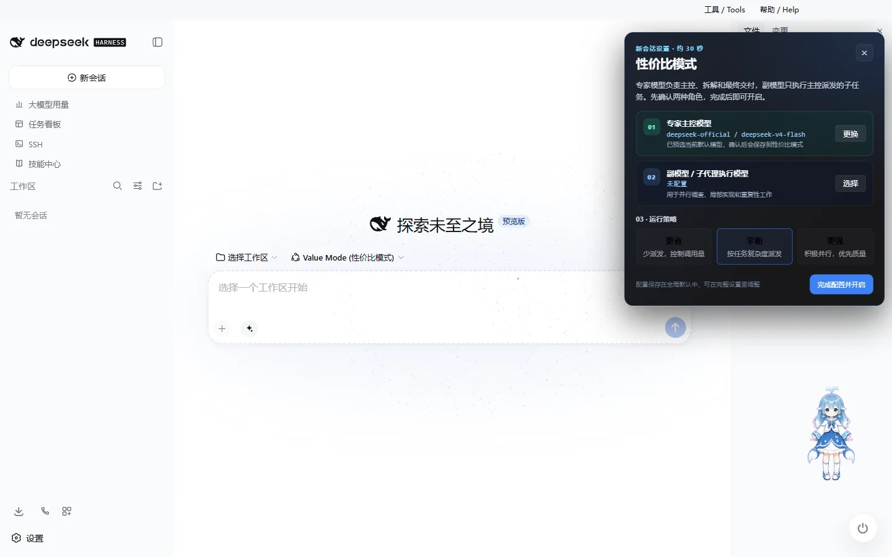
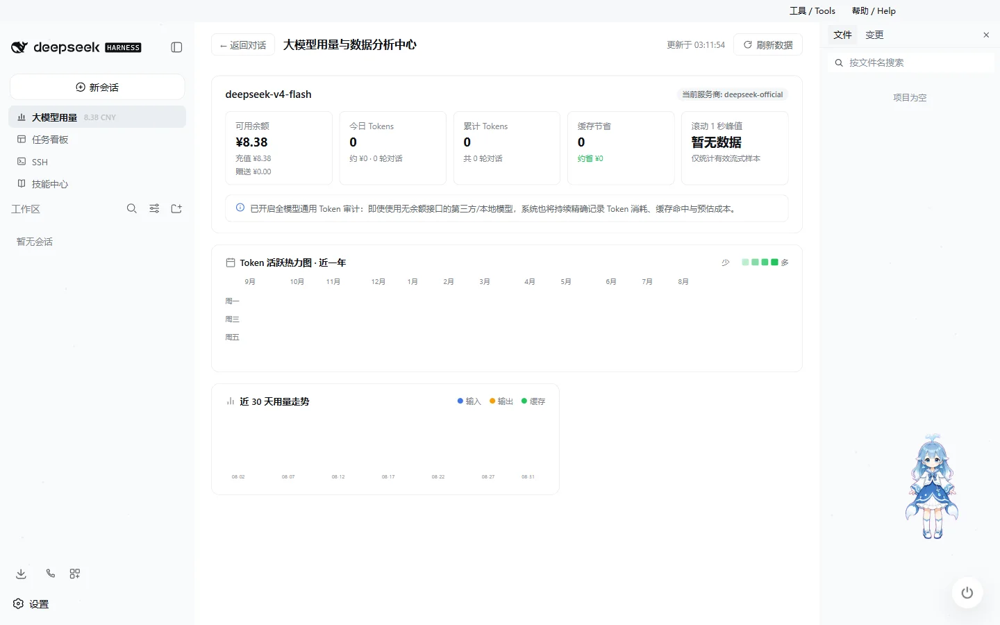
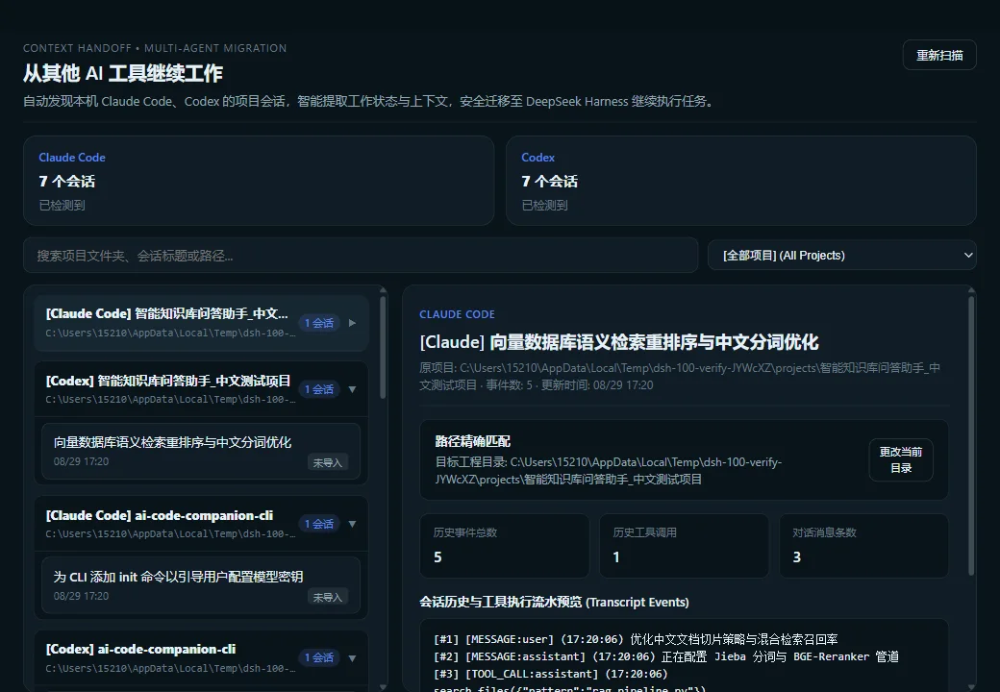
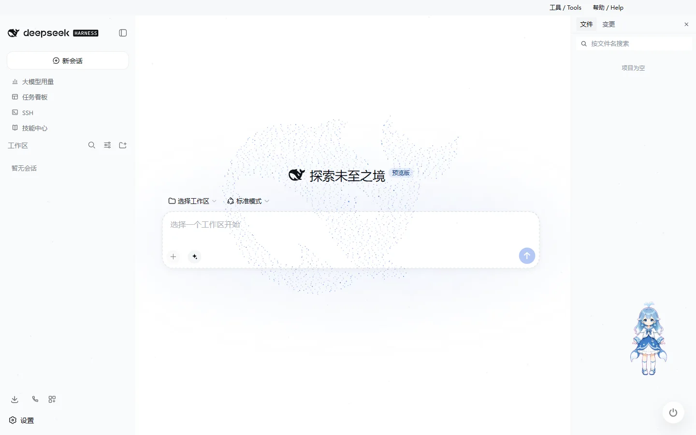

# DeepSeek Harness Desktop

中文 | [English](README.en.md)

> ❤️ **支持项目持续开发**：如果 DeepSeek Harness Desktop 对你有帮助，欢迎在[爱发电支持作者](https://www.ifdian.net/a/ningbai)。你的支持将用于服务器、测试环境和后续维护。

## DeepSeek Harness Desktop 用户交流群

QQ 群：**1105158177**

**[点击一键加入 QQ 群](https://qm.qq.com/q/vehlNjaeye)**

欢迎加入社群交流：

- 使用与配置交流
- 插件与 Skills 分享
- 模型配置与使用经验
- 自动化玩法
- 主题与桌宠
- 新版本体验与功能建议

> **GitHub 下载速度较慢？**  
> 群内会同步提供最新版安装包，也可以直接交流安装与使用问题。

---

**DeepSeek Harness Desktop** 是社区维护的开源 Windows AI 编程桌面客户端。

它将 **DeepSeek Harness Web、DSH 本地运行环境、Skills、插件、任务自动化、Git、远程开发与桌面扩展能力** 集成到一个 Windows 应用中，让你无需复杂配置，就能获得完整的 Harness AI 编程体验。

支持 **Windows 10 / 11 x64**，采用 **BSD-3-Clause** 许可证。

安装包已包含主要运行组件，无需另外配置 Node.js、Git 或单独安装 DSH。

[产品介绍](https://ningbainb.github.io/deepseek-harness-desktop/) · [下载最新版](https://github.com/ningbainb/deepseek-harness-desktop/releases/latest) · [使用文档](docs/desktop.md) · [更新日志](CHANGELOG.md)

### 最新版本：3.2.0

- **性价比模式 V2**：专家主控模型负责理解、拆解、派发、复核和汇总，副模型 / 子代理只处理被派发的局部任务；首次选择会自动引导配置。
- **大模型用量看板**：实时展示余额、输入/输出 Token、上下文、缓存、请求耗时与费用；峰值采用严格滚动 1 秒算法，不再把一次 usage 汇总事件误当作瞬时速率。
- **Claude Code / Codex 项目导入**：只读发现项目和历史会话，预览后导入 Harness 工作区；敏感信息脱敏，历史工具调用不会重新执行。
- **启动与插件稳定性继续加固**：启动阶段可见、事务修复可回滚、第三方插件错误隔离，原有 DSH Home 与插件直接延续。

[查看完整发布说明](docs/launch/release-notes.md) · [查看历史更新日志](CHANGELOG.md) · [升级与回滚指南](docs/upgrade-and-rollback.md)

---

## 3.2.0 三个核心能力

### 性价比模式：专家做决策，副模型做执行

选择 **性价比模式** 后，桌面端会立即打开配置引导：默认模型会自动预选为 **专家主控模型**，用户再选择一个更省或更快的 **副模型 / 子代理执行模型**，最后选择“更省 / 智能平衡 / 更强”策略。配置完整后才会启用，不会留下半配置状态。

专家主控可以直接完成简单任务，也可以按需派发并行子任务；副模型的子代理深度固定为 1，不递归派发、不调用重复的“专家分析”路径。每个会话的主控调用和副模型调用都能在界面与埋点中区分。

### 大模型用量看板：看清每一次消耗

会话状态行和用量看板集中呈现 Input / Output Token、上下文占用、Cache 命中、LLM 延迟、估算费用、当前生成速度与步骤内峰值。生成速度只来自有效流式增量：同毫秒批次先合并，在每个时间点统计过去 1 秒窗口；最终 usage 只修正账单 Token，不制造虚假瞬时峰值。

### Claude Code 与 Codex：把已有工作接着做

选择本机的 Claude Code 或 Codex 数据目录，按项目查看可导入的历史会话，确认后生成真正的 Harness 工作区和会话。导入是只读、幂等、可恢复的：API Key、Token、Cookie、路径等敏感字段会脱敏，外部工具调用以历史记录保存且不可执行。

详细边界见 [外部会话导入说明](docs/external-conversation-import.md)；模型角色与路由见 [性价比模式插件](packages/dsh-value-mode/README.zh.md)；峰值算法见 [实时用量看板](packages/dsh-live-stats/README.zh.md)。

## 为什么选择 DeepSeek Harness Desktop

### 开箱即用

下载安装 EXE 后即可启动完整 Harness 环境。

无需手动准备 Node.js、Git、pnpm 或 DSH Runtime，桌面端会统一管理所需组件与运行环境。

### 完整 AI 编程工作台

在一个桌面应用中完成：

- AI 对话与代码修改
- 项目文件浏览与编辑
- Git / SCM 操作
- Markdown、HTML、代码、Diff、PDF、Office 等文件预览
- 模型切换与推理强度调整
- Skills 与插件调用
- Agent 任务执行
- Token 与性能统计
- 多项目开发工作流

### Skills 与插件生态

支持多种扩展方式：

- DSH Skills
- Agents Skills
- 项目 Skills
- 社区 DSH Bundle
- 插件市场
- 桌面扩展

可以直接在 Harness 中搜索、安装和使用扩展能力，将自己的开发工具逐步组合成一套完整工作流。

### 任务看板与自动化

内置任务看板，可以管理：

**待规划 → 待办 → 进行中 → 已完成 / 已失败**

任务可以交给真实 DSH Agent Session 执行，并记录 Task Run 与 Evidence，方便查看结果和继续处理。

同时支持定时任务与后台调度，适合周期性的开发、维护和自动化工作。

### 远程开发

桌面版不仅可以操作本机项目，也支持远程开发场景：

- 手机远程控制
- SSH
- Web Terminal
- SFTP
- 端口转发
- 多主机集群执行
- QQ Bot 接入

可以从电脑、手机或聊天工具连接自己的 Harness 工作环境。

### 个性化桌面体验

除了开发能力，Desktop 还提供完整的桌面化体验：

- 多套主题皮肤
- 全页粒子主题
- 鲸鱼娘桌宠
- 独立窗口
- 窗口状态保存
- 桌面通知
- 托盘能力
- Stable / Beta 更新频道

---

## Harness AI 编程工作台

桌面版直接运行 DeepSeek Harness Web Surface，并由桌面宿主管理本地 DSH Runtime。

在同一个窗口中即可完成 AI 对话、代码修改、文件管理、Git 操作、任务执行、模型切换和插件扩展。

## Skills 与插件

输入框可以直接搜索并插入已安装 Skills。

扩展坞支持：

- 社区 DSH Bundle
- 插件市场
- 项目 Skills
- DSH Skills
- Agents Skills

桌面版使用独立的 `desktop` profile，不会覆盖已有 DSH 配置。

插件安装、更新以及运行时生命周期均由桌面宿主统一管理。

## Codex 模型与推理强度

3.0.9 使用 DSH RC.1 内置的 `llm-pi-ai/openai-codex` 官方授权流程完成 ChatGPT OAuth，并在 Harness 中使用支持的 OpenAI Codex 模型；不再加载会与原生 Provider 冲突的旧 `dsh-codex-connect` 插件。设置页的「ChatGPT 登录」一次点击启动 OAuth，并由系统浏览器继续；授权 grant 只由官方凭据服务读写并保存在本机 DSH Home，前端只读取"是否已登录"，不会收到 access token 或 refresh token。它不会默认替换当前模型、接管全局搜索或启用远程图片工具。

模型切换时，桌面端会根据模型实际能力展示可用的推理强度档位，并自动处理对应配置。

## 任务看板与自动化

通过任务看板统一管理 Agent 工作。

| 多列任务看板 | 任务详情与定时执行 |
| --- | --- |
|  |  |

任务可以直接交给 DSH Agent Session 执行，并保存 Task Run 与 Evidence。

除了手动任务之外，还支持定时任务和后台调度，可以用于周期性开发、信息处理和维护工作。

## Git 图谱

通过分支选择器和 Git 图谱查看分支关系、Commit 历史、当前仓库状态和分支泳道，帮助快速理解项目变化和代码提交历史。

## 文件、预览与 SCM

项目会话右侧提供完整工作面板：

- **文件树**：浏览和搜索工作区文件
- **文件预览**：Markdown、HTML、代码、Diff、CSV、PDF、Office、图片和文本
- **编辑与保存**：源码 / 预览切换以及分屏操作
- **Git 变更**：查看真实 SCM 状态并执行 Stage / Unstage / Discard
- **可调布局**：记录不同项目的面板宽度和折叠状态

## 手机远程控制

通过桌面端二维码即可连接当前 Harness 工作区。

手机端可以查看工作区、新建和查看会话、收发消息、切换模型、调整思考强度，并与桌面端保持同步。

默认可以在局域网环境使用，也可以根据需要启用公网隧道。

| 工作区列表 | 会话列表 |
| --- | --- |
|  |  |
| **移动端聊天** | **模型与思考强度** |
|  |  |

## SSH 远程开发

侧边栏内置 SSH 面板，可以直接管理远程服务器，并与 Agent 共用连接配置。

支持：

- Web Terminal
- SFTP 上传 / 下载
- 本地端口转发
- 多主机集群执行
- 从 `~/.ssh/config` 导入主机
- 在 Agent 对话中直接调用已配置的远程主机

让 Harness 不仅能操作本机项目，也可以直接参与服务器和远程开发环境中的工作。

## QQ Bot 接入

桌面版集成腾讯 QQ Bot Connector。

可以通过扩展坞扫码完成连接，让 QQ 私聊和群聊与本机 Harness 联动。

连接信息由桌面宿主管理，无需手动修改复杂配置文件。

## 大模型用量看板与性能统计

输入区域下方可以实时查看：

- 滚动 1 秒生成速度与步骤内峰值
- LLM 请求耗时
- 上下文占用
- Cache 命中率
- Input Token
- Output Token

## 主题与皮肤

桌面版内置多套主题，并支持先预览、再应用。

当前包括 Harbor、Windows XP / Luna、Minecraft 方块世界、Blue Fantasy、鲸吟、初音未来、Trading Terminal、QQ 怀旧主题等风格。

### 鲸鱼娘桌宠

内置鲸鱼娘桌宠。

桌宠会根据 Agent 的思考、工作、等待和完成状态自动切换不同动画，同时支持互动、命名、拖拽和隐藏。

| 陪伴工作 | 互动面板 |
| --- | --- |
|  |  |

### 全页粒子主题

粒子鲸鱼主题不仅可以显示在启动页面，也可以直接应用到 Harness 主界面，并根据输入、弹窗、后台状态和系统「减少动态效果」设置自动调整视觉效果。

---

## 下载与安装

1. 打开 [GitHub Releases](https://github.com/ningbainb/deepseek-harness-desktop/releases/latest)。
2. 下载 `DeepSeek-Harness-Desktop-Setup-<版本号>-x64.exe`。
3. 运行安装程序完成安装。
4. 启动 **DeepSeek Harness Desktop**。

安装包已经包含 DSH、桌面插件、皮肤、pnpm、MinGit 与所需原生依赖，不需要额外安装 Node.js 或 Git。

如果 GitHub 下载速度较慢，也可以加入页面顶部的用户交流群获取同步提供的安装包。

## 更新

DeepSeek Harness Desktop 支持应用内版本检查，发现新版本后可以查看更新内容并选择升级。

提供两个更新频道：

- **Stable**：默认频道，适合绝大多数用户。
- **Beta**：用于体验较新的功能，需要用户主动切换。

升级过程中会尽可能保留已有 DSH_HOME、Desktop Profile、社区 Bundle、Skills、皮肤配置与桌宠状态。

更多信息：

- [升级与回滚](docs/upgrade-and-rollback.md)
- [兼容性政策](docs/compatibility-policy.md)
- [运行时支持政策](docs/runtime-support-policy.md)
- [完整发布说明](docs/launch/release-notes.md)

## 安全与隐私

DeepSeek Harness Desktop 默认尽可能将用户数据和运行环境保留在本机。

主要设计包括：

- DSH Runtime 默认监听本机回环地址
- 桌面主界面与扩展能力采用独立权限边界
- 外部链接通过系统浏览器打开
- OAuth、QQ Bot 等凭据保存在本机
- 遥测默认关闭
- 诊断信息只有在用户主动操作时才会导出
- 导出的诊断信息会对 Token、Secret、Cookie、路径、Prompt、Session 和 Tool Result 等内容进行脱敏

## 文档

- [桌面版技术说明](docs/desktop.md)
- [兼容性政策](docs/compatibility-policy.md)
- [运行时支持政策](docs/runtime-support-policy.md)
- [升级与回滚](docs/upgrade-and-rollback.md)
- [发布与交接工作流](docs/launch/desktop-release-workflow.md)
- [更新日志](CHANGELOG.md)

## 开源与版权

本项目采用 **[BSD-3-Clause](LICENSE)** 许可证开源。

- 本项目代码及内置功能插件、主题皮肤与桌面端均遵循 BSD-3-Clause 开源协议。
- 迁入与引用的第三方代码及环境依赖均保留其原始开源许可证与作者署名。

## Star History

<a href="https://www.star-history.com/?repos=ningbainb%2Fdeepseek-harness-desktop&type=date&legend=top-left">
 <picture>
   <source media="(prefers-color-scheme: dark)" srcset="https://api.star-history.com/chart?repos=ningbainb/deepseek-harness-desktop&type=date&theme=dark&legend=top-left&sealed_token=uz8tv2Zw0Y2_JAybqcIqmwNfh1T4of91EHnFEz-Bxh28xljI3KiZet4ykSVHn9mBULuP0l8FFLHDhudWLQDyfH8pBNAj7Yp6AwseXsGazp8hfpFOt6x0Lg" />
   <source media="(prefers-color-scheme: light)" srcset="https://api.star-history.com/chart?repos=ningbainb/deepseek-harness-desktop&type=date&legend=top-left&sealed_token=uz8tv2Zw0Y2_JAybqcIqmwNfh1T4of91EHnFEz-Bxh28xljI3KiZet4ykSVHn9mBULuP0l8FFLHDhudWLQDyfH8pBNAj7Yp6AwseXsGazp8hfpFOt6x0Lg" />
   
 </picture>
</a>

## 友情链接

本项目积极参与并认可 [LINUX DO 社区](https://linux.do)。

---

  <b>让 DeepSeek Harness 在 Windows 上真正成为一个可以每天使用的 AI 编程桌面工作台。</b>

  如果你喜欢这个项目，欢迎点一个 Star。

